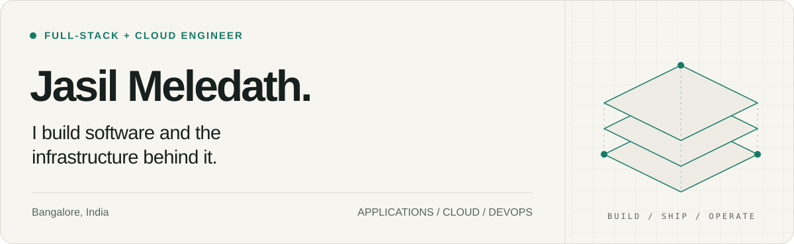
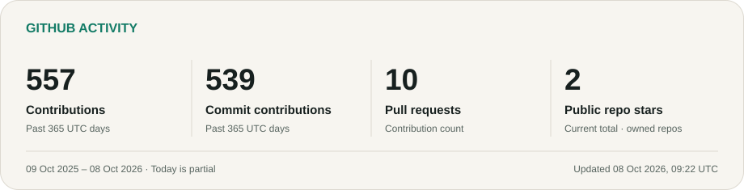
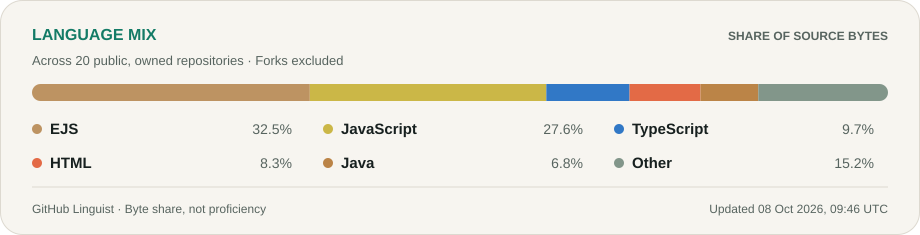

<a href="https://jasil-portfolio-nu.vercel.app/">
  <picture>
    <source media="(max-width: 600px) and (prefers-color-scheme: dark)" srcset="./assets/hero-mobile-dark.svg" />
    <source media="(max-width: 600px) and (prefers-color-scheme: light)" srcset="./assets/hero-mobile-light.svg" />
    <source media="(prefers-color-scheme: dark)" srcset="./assets/hero-dark.svg" />
    <source media="(prefers-color-scheme: light)" srcset="./assets/hero-light.svg" />
    
  </picture>
</a>

  <a href="https://jasil-portfolio-nu.vercel.app/"><b>Portfolio ↗</b></a>
  &nbsp; · &nbsp;
  <a href="https://www.linkedin.com/in/jasilmeledath">LinkedIn</a>
  &nbsp; · &nbsp;
  <a href="mailto:jasilmeledath@gmail.com">Email</a>

I'm a full-stack and cloud engineer based in **Bangalore, India**. I build web applications, backend systems, and the infrastructure that keeps them running—from data models and APIs to deployment pipelines and production monitoring.

My work spans client products, open-source developer tools, and experiments with AI and persistent memory. I care about clear architecture, useful interfaces, and systems that are practical to operate.

## Selected work

### Woobe · E-commerce platform

Co-developed a fashion commerce platform with separate storefront, admin, and API applications. Provisioned AWS infrastructure with Terraform and built delivery pipelines with immutable Docker images, health checks, and automatic rollback. Added Prometheus and Grafana for application and host monitoring.

**TypeScript · Next.js · Node.js · PostgreSQL · Redis · AWS · Terraform**  
[Project background ↗](https://jasil-portfolio-nu.vercel.app/#experience)

### Picbox · Inventory & invoicing

Built an inventory and operations system for an event-management client, covering rental stock, jobs, staff wages, and PDF invoices. Designed the backend around transactional updates and automated database backups, with a React Native interface.

**React Native · Express · MongoDB**  
[Application ↗](https://github.com/jasilmeledath/picbox-inventory-managment-app-react-native-nodejs) · [Backend ↗](https://github.com/jasilmeledath/picboxbackend)

### Uniwayin · CRM platform

Built a production backend for an educational consultancy, bringing leads, follow-ups, notes, and analytics into one system. Implemented access and refresh authentication, role-based permissions, audit logging, and scheduled follow-up jobs.

**NestJS · MongoDB · REST APIs**  
[Explore the API ↗](https://github.com/jasilmeledath/uniwayin-ums-api)

## Tools & experiments

| Project | What I'm building |
| :--- | :--- |
| **[TracePanel ↗](https://github.com/jasilmeledath/trace-panel-npm)** | A live request-flow visualizer for Node.js and Express. Uses AsyncLocalStorage and OpenTelemetry to connect middleware, database queries, and HTTP calls, with sensitive-field redaction. [View on npm](https://www.npmjs.com/package/trace-panel). |
| **[Ghost memory daemon ↗](https://github.com/jasilmeledath/ghost-memory-daemon)** | The persistent memory layer behind my personal AI assistant. A Python daemon keeps Kuzu and LanceDB resident and serves graph and vector retrieval over Unix sockets. |

## My working stack

| Area | Technologies |
| :--- | :--- |
| **Languages** | TypeScript, JavaScript, Python, Java, SQL |
| **Applications & APIs** | React, Next.js, React Native, Node.js, Express, NestJS, Fastify |
| **Data & background work** | PostgreSQL, MongoDB, Redis, Prisma, BullMQ |
| **Cloud & delivery** | AWS, Docker, Terraform, GitHub Actions, Linux, Nginx |
| **Observability & AI** | Prometheus, Grafana, OpenTelemetry, LLM integrations, RAG |

## GitHub activity

<a href="https://github.com/jasilmeledath?tab=overview">
  <picture>
    <source media="(max-width: 600px) and (prefers-color-scheme: dark)" srcset="./assets/activity-mobile-dark.svg" />
    <source media="(max-width: 600px) and (prefers-color-scheme: light)" srcset="./assets/activity-mobile-light.svg" />
    <source media="(prefers-color-scheme: dark)" srcset="./assets/activity-dark.svg" />
    <source media="(prefers-color-scheme: light)" srcset="./assets/activity-light.svg" />
    
  </picture>
</a>

Scheduled to refresh daily from GitHub's API. The card shows the exact period and last successful update. [View source data](./assets/metrics.json) · [Contribution history ↗](https://github.com/jasilmeledath?tab=overview)

<b>Repository languages & how these numbers are counted</b>

 

<picture>
  <source media="(max-width: 600px) and (prefers-color-scheme: dark)" srcset="./assets/languages-mobile-dark.svg" />
    <source media="(max-width: 600px) and (prefers-color-scheme: light)" srcset="./assets/languages-mobile-light.svg" />
    <source media="(prefers-color-scheme: dark)" srcset="./assets/languages-dark.svg" />
  <source media="(prefers-color-scheme: light)" srcset="./assets/languages-light.svg" />
  
</picture>

- **Contributions** are GitHub's contribution-calendar total for the displayed UTC date window. Commit and pull request contributions are separate breakdowns within that window; they are not added to the total again.
- **Visibility** follows the credentials used by the workflow and GitHub's contribution rules. Private work may not be represented; these totals may differ from a signed-in profile or a different date range.
- **Stars and languages** cover my public, owned, non-fork repositories, including archived repositories. Stars are a current total, independent of the activity date window.
- **Language percentages** use GitHub's reported bytes of code across that repository set. They describe repository contents, not proficiency, authorship, or time spent coding.
- On an API failure, the previous successful cards stay in place with their original timestamp.

---

  <b>Let's build something useful.</b> 
  Open to collaboration on full-stack products, cloud infrastructure, and developer tools.  
  <a href="mailto:jasilmeledath@gmail.com">jasilmeledath@gmail.com</a>
  &nbsp; · &nbsp;
  <a href="https://jasil-portfolio-nu.vercel.app/">Explore my work ↗</a>

